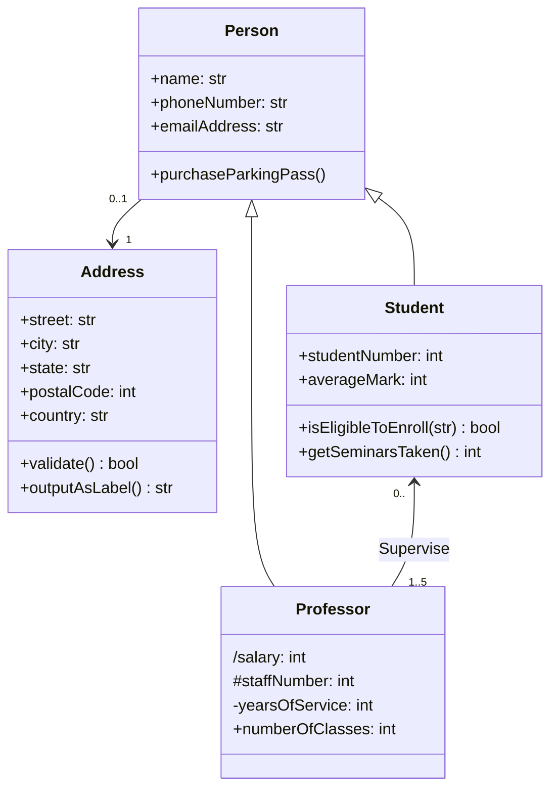

```mermaid
classDiagram
    direction TB

    class Person{
        +name: str
        +phoneNumber: str
        +emailAddress: str
        +purchaseParkingPass()
    }

    class Address{
        +street: str
        +city: str
        +state: str
        +postalCode: int
        +country: str
        +validate() bool
        +outputAsLabel() str
    }

    class Student{
        +studentNumber: int
        +averageMark: int
        +isEligibleToEnroll(str) bool
        +getSeminarsTaken() int 
    }

    class Professor{
        /salary: int
        #staffNumber: int
        -yearsOfService: int
        +numberOfClasses: int
    }

    Person <|-- Student
    Person <|-- Professor
    Student "0.." <-- "1..5" Professor : Supervise
    Person "0..1" --> "1" Address
```