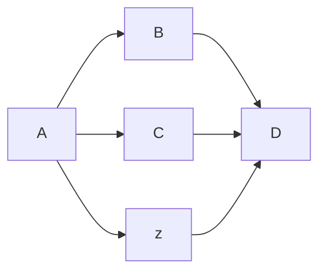
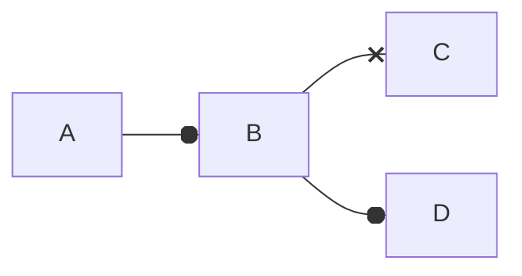

```mermaid
flowchart LR
    id[\첫 번째 노드/]
```

```mermaid
flowchart LR
    A -- text --> B -- text2 --> C
```

```mermaid
flowchart LR
    A --> B & C & z --> D
```

```mermaid
flowchart LR
    A --o B
    B --x C
    B --o D
```