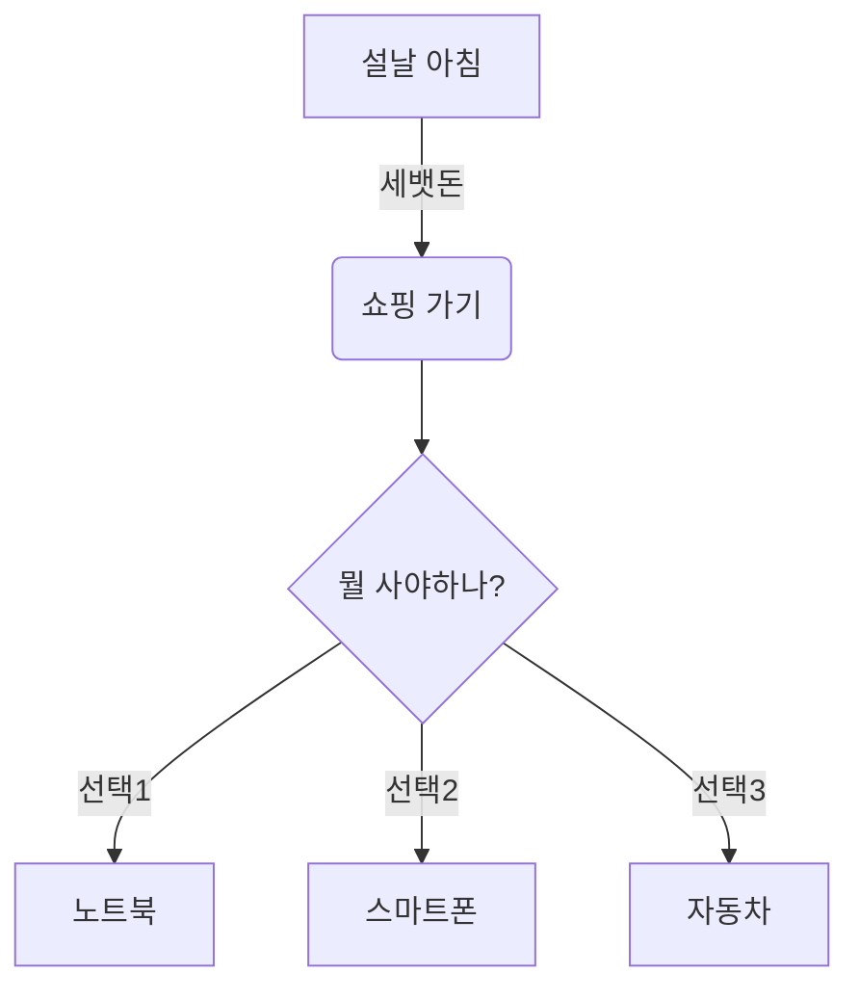

# Mermaid 실습
- FlowChart 실습
    - 첫번째 sample



```mermaid
flowchart
    A[설날 아침] -->|세뱃돈| B(쇼핑 가기)
    B --> C{뭘 사야하나?}
    C -->|선택1| D[노트북]
    C -->|선택2| E[스마트폰]
    C -->|선택3| F[자동차] 
```

```python
print('hello world')
```

