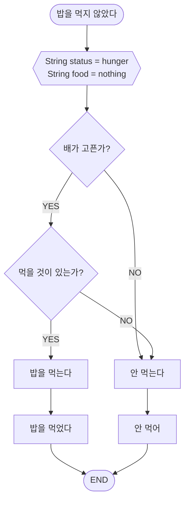

```mermaid
flowchart TB
id1([밥을 먹지 않았다])

id2{{String status = hunger <br> String food = nothing}}

id3{배가 고픈가?}

id4{먹을 것이 있는가?}

id5[안 먹는다]
id5_1[안 먹어]

id6[밥을 먹는다]

id6_1[밥을 먹었다]

id7([END])

%%연결선 작업
id1 --> id2 
--> id3 -->|YES| id4 
id3 -->|NO| id5
id4 -->|NO| id5
id4 -->|YES| id6
id6 --> id6_1
id6_1 --> id7
id5 --> id5_1
id5_1 --> id7


```
