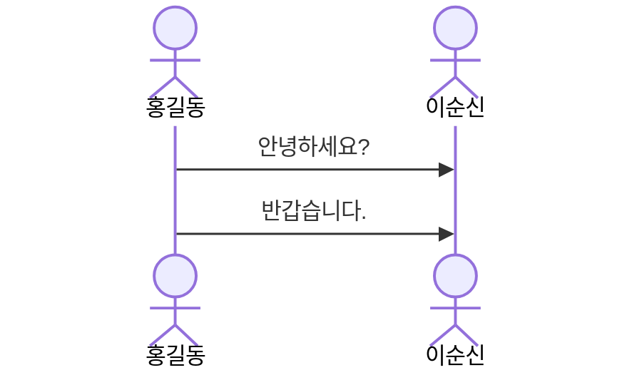
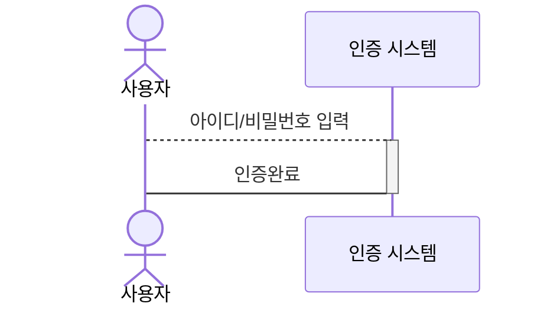
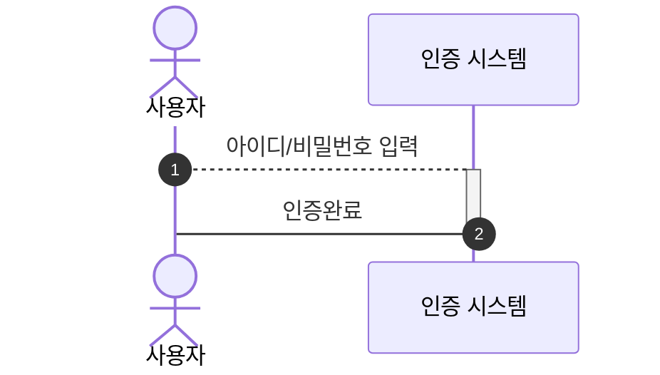
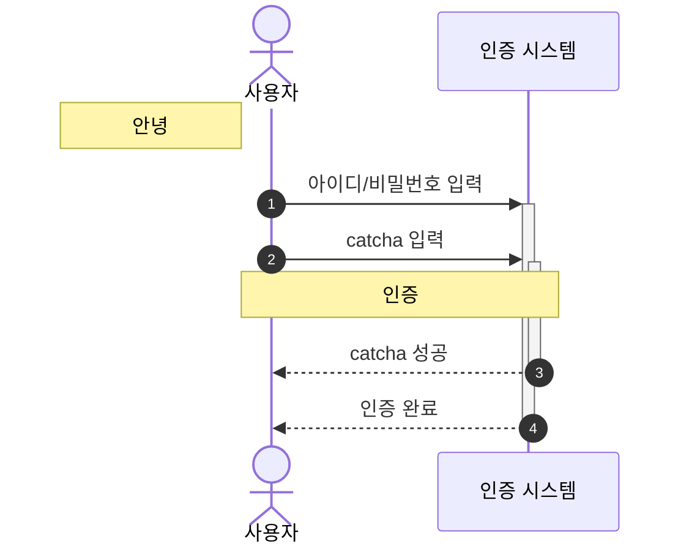
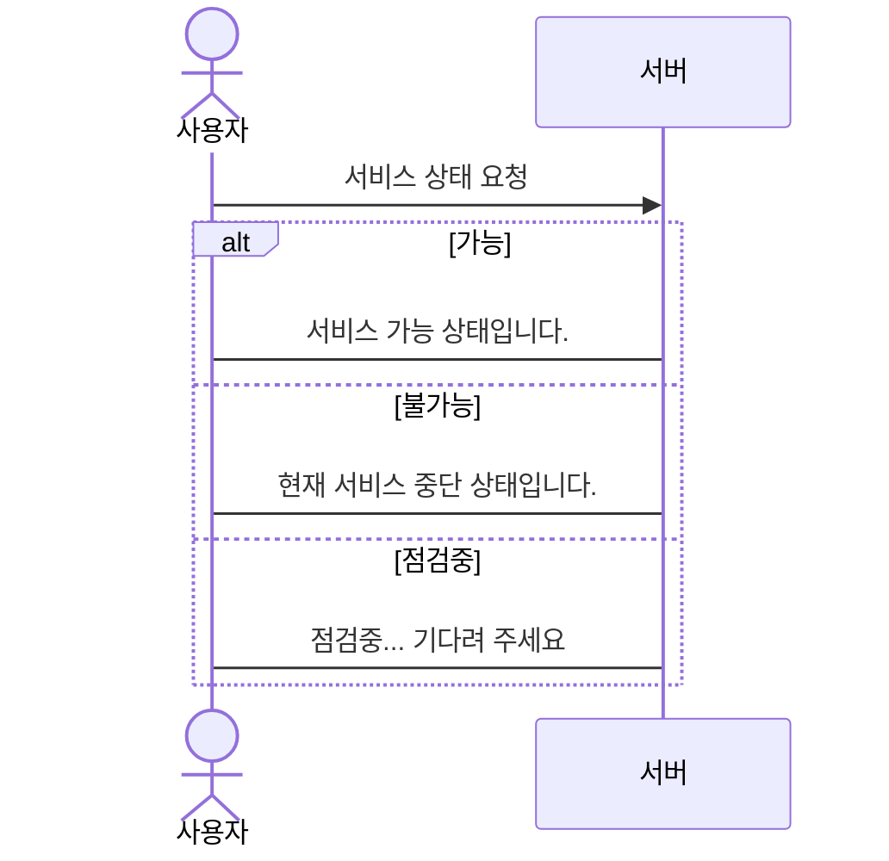

```mermaid
sequenceDiagram
    actor a as 홍길동
    actor b as 이순신
    a ->> b: 안녕하세요?
    a ->> b: 반갑습니다.
```

```mermaid
sequenceDiagram
    actor A as 사용자
    participant B as 인증 시스템
    A --> B: 아이디/비밀번호 입력
    activate B
    B -> A: 인증완료
    deactivate B
```

```mermaid
sequenceDiagram
    autonumber
    actor A as 사용자
    participant B as 인증 시스템
    A -->+ B: 아이디/비밀번호 입력
    B ->- A: 인증완료
```

```mermaid
sequenceDiagram
    autonumber
    actor A as 사용자
    Note left of A: 안녕
    participant B as 인증 시스템

    A ->>+ B: 아이디/비밀번호 입력
    A ->>+ B: catcha 입력
        Note over A, B: 인증
    B -->>- A: catcha 성공
    B -->>- A: 인증 완료
```

```mermaid
sequenceDiagram
    actor A as 사용자
    participant B as 서버
    
    A ->> B: 서비스 상태 요청
    
    alt 가능
        B -> A: 서비스 가능 상태입니다.
    else 불가능
        B -> A: 현재 서비스 중단 상태입니다.
    else 점검중
        B -> A: 점검중... 기다려 주세요
    end
```