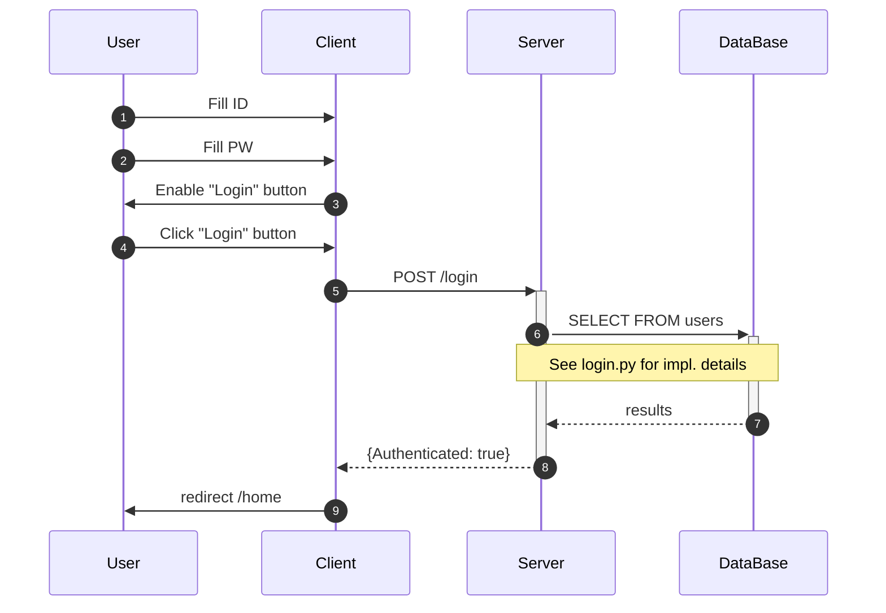

```mermaid
sequenceDiagram
autonumber
    participant U as User
    participant C as Client
    participant S as Server
    participant D as DataBase

    U ->> C: Fill ID
    U ->> C: Fill PW
    C ->> U: Enable "Login" button
    U ->> C: Click "Login" button

    C ->>+ S: POST /login
        S ->>+ D: SELECT FROM users
        Note over D,S: See login.py for impl. details
        D -->>- S: results
    S -->>- C: {Authenticated: true}

    C ->> U: redirect /home
```